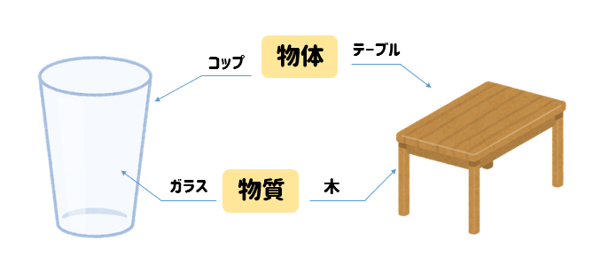

シャープペン、机、ジュース。。。物体 
ゴム、プラスチック、水。。。物質 

---
- - -
アルミ缶、スチール缶...金属 
砂糖、デンプン、食塩...非金属

---
 
 - - -                 
砂糖、デンプン、プラスチック、木...有機物 
アルミ缶、スチール缶、食塩...無機物

<aside class="notes">
  発表者が見るノート   
  伝えたいことをメモ  
</aside>